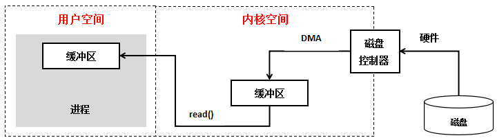
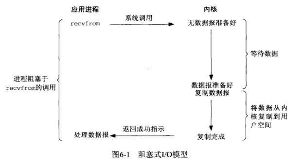
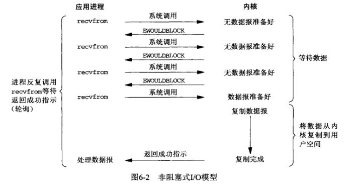
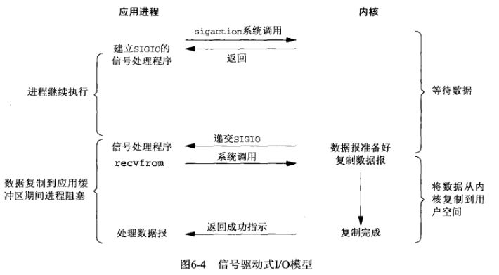
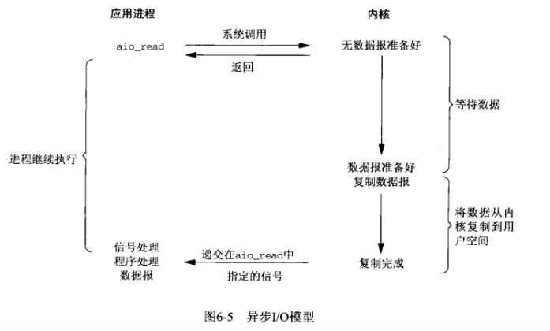

### 什么是IO？
我们都知道unix世界里、一切皆文件、而文件是什么呢？文件就是一串二进制流而已、不管socket、还是FIFO、管道、终端、对我们来说、一切都是文件、一切都是流、在信息交换的过程中、我们都是对这些流进行数据的收发操作、简称为I/O操作(input and output)、往流中读出数据、系统调用read、写入数据、系统调用write、不过话说回来了、计算机里有这么多的流、我怎么知道要操作哪个流呢？做到这个的就是文件描述符、即通常所说的fd、一个fd就是一个整数、所以对这个整数的操作、就是对这个文件（流）的操作、我们创建一个socket、通过系统调用会返回一个文件描述符、那么剩下对socket的操作就会转化为对这个描述符的操作、不能不说这又是一种分层和抽象的思想。

### 什么是非阻塞IO
所谓非阻塞IO就是当进程发起读取数据申请时，如果内核数据没有准备好会即刻告诉进程，而不是让B原地等待。    

较为正式的定义：非阻塞IO是在应用调用recvfrom读取数据时，如果该缓冲区没有数据的话，就会直接返回一个EWOULDBLOCK错误，不会让应用一直等待中。在没有数据的时候会即刻返回错误标识，那也意味着如果应用要读取数据就需要不断的调用recvfrom请求，直到读取到它数据要的数据为止。

### IO交互过程

通常用户进程中的一个完整IO分为两个阶段：

用户空间<------------->内核空间

内核空间<------------->设备空间

内核空间中存放的是内核代码和数据、而进程的用户空间中存放的是用户程序的代码和数据、不管是内核空间还是用户空间、它们都处于虚拟空间中。Linux使用两级保护机制：0级供内核使用、3级供用户程序使用、操作系统和驱动程序运行在内核空间、应用程序运行在用户空间、两者不能简单地使用指针传递数据、因为Linux使用的虚拟内存机制、其必须通过系统调用请求kernel来协助完成IO动作、内核会为每个IO设备维护一个缓冲区、用户空间的数据可能被换出、当内核空  间使用用户空间指针时、对应的数据可能不在内存中
对于一个输入操作来说、进程IO系统调用后、内核会先看缓冲区中有没有相应的缓存数据、没有的话再到设备中读取、因为设备IO一般速度较慢、需要等待、内核缓冲区有数据则直接复制到进程空间。
所以、对于一个网络输入操作通常包括两个不同阶段：

（1）等待网络数据到达网卡然后读取到内核缓冲区

（2）从内核缓冲区复制数据到用户空间

IO有内存IO、网络IO和磁盘IO三种，因为内存比后两者快非常多，所以通常我们说的IO指的是后两者。

### 阻塞IO（blocking I/O）
在内核将数据准备好之前，系统调用会一直等待所有的套接字，默认的是阻塞方式。 

这个模型最简单，最符合人脑思维，当前线程（进程的主线程）阻塞在recvfrom的系统调用中，等到内核将所有的数据报准备好之后复制到用户控件，然后返回成功提示。

### 非阻塞IO（no-blocking I/O）

每次进程询问内核是否有数据准备好（即文件描述符缓冲区是否就绪）当有数据报准备好时，就进行拷贝数据报的操作。当没有数据报准备好时，也不阻塞程序，内核直接返回未准备就绪的信号，等待用户程序的下一个轮寻。

但是，轮询对于CPU来说是较大的浪费（打开任务管理器会发现cpu占用率基本接近100%），一般只有在特定的场景下才使用。

### IO多路复用（I/O multiplexing）
假设10万个客户端同时和当前进程进行通信（高并发），按照前面的NIO模型，每个线程不断去调用recvfrom系统调用，内核很崩溃。
于是乎IO多路复用就有了：

描述：多路复用IO多了一个select函数，select函数有一个参数是文件描述符集合，对这些文件描述符进行循环监听，当某个文件描述符就绪时，就对这个文件描述符进行处理，通知对应的线程调用recvfrom系统调用。

总结：多路复用的基本思路就是通过select或poll、epoll 来监控多fd，来达到不必为每个fd创建一个对应的监控线程，从而减少线程资源创建。

IO多路复用具体的实现有：select、poll、epoll。

### 信号驱动IO（signal-blocking I/O）
因为IO多路复用中，选择器（select或poll、epoll）还是需要轮询去监控所有的fd，明眼人一看就知道此时需要优化的内容：主动轮询转化为被动通知。

描述：开启套接口信号驱动IO功能，并通过系统调用sigaction执行一个信号处理函数，此时请求即刻返回，当数据准备就绪时，就对对应进程的发送SIGIO信号，通过信号回调通知应用线程调用recvfrom系统调用来读取数据。
总结： IO复用模型里面的select虽然可以监控多个fd了，但select其实现的本质上还是通过不断的轮询fd来监控数据状态， 因为大部分轮询请求其实都是无效的，所以信号驱动IO意在通过这种建立信号关联的方式，实现了发出请求后只需要等待数据就绪的通知即可，这样就可以避免大量无效的数据状态轮询操作。

### 异步IO（asynchronous I/O）

描述：当应用程序调用aio_read时，内核一方面去取数据报内容返回，另一方面将程序控制权还给应用进程，应用进程继续处理其他事情，是一种非阻塞的状态。
当内核中有数据报就绪时，由内核将数据报拷贝到应用程序中，返回到aio_read中定义好的函数处理程序。

信号驱动IO只是由内核通知我们合适可以开始下一个IO操作，而异步IO模型是由内核通知我们操作什么时候完成。

很少有Linux系统支持，Windows的IOCP就是该模型。

总结：异步IO的优化思路是解决了应用程序需要先后发送询问请求、发送接收数据请求两个阶段的模式，在异步IO的模式下，只需要向内核发送一次请求就可以完成状态询问和数拷贝的所有操作。

### 概念区分
阻塞/非阻塞：所谓阻塞就是发起读取数据请求的时，当数据还没准备就绪的时候，这时请求是即刻返回，还是原地等待数据的就绪，如果需要等待的话就是阻塞，反之如果即刻返回就是非阻塞。

同步/异步：在IO模型里面如果请求方从发起请求到数据最后完成的这一段过程中都需要自己参与，那么这种我们称为同步请求；反之，如果应用发送完指令后就不再参与过程了，只需要等待最终完成结果的通知，那么这就属于异步。

同步阻塞/非阻塞：他们的不同只是发起读取请求的时候一个请求阻塞，一个请求不阻塞，但是相同的是，他们都需要应用自己监控整个数据完成的过程。
异步非阻塞：为什么只有异步非阻塞 而没有异步阻塞？因为异步模型下请求指定发送完后就即刻返回，没有任何后续流程，所以它注定不会阻塞，所以只有有异步非阻塞模型，没有异步阻塞模型。

综上，阻塞程度：阻塞IO>非阻塞IO>多路复用IO>信号驱动IO>异步IO，效率是由低到高的。

参考链接：
> https://www.cnblogs.com/shengguorui/p/11949282.html
> https://zhuanlan.zhihu.com/p/115912936
